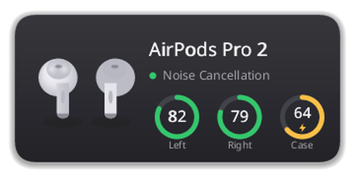

### Hi, I'm Rocky

Developer from Germany, building open-source tools for the Linux desktop:
device control, audio and Bluetooth, mostly in Python and Rust around KDE
Plasma and Wayland. I also run [key64](https://www.key64.com), my own small
platform with a Discord bot, dashboard, status page and CDN.

Lately I'm working my way down the stack: kernel modules, DRM and V4L2.

###  Refrain

**Discord Rich Presence for Apple Music on Linux.** Apple Music has no Linux
app, and the web player never shows up in Discord. Refrain is a small tray app
that puts the song you're playing into your Discord status, with cover art.

- Reads music.apple.com in Chrome, Chromium, Firefox and Zen, or a phone over Bluetooth
- Optional Last.fm scrobbling, tray controls, recently played list, 10 languages
- No account, no telemetry, everything stored locally
- Install from the AUR (`yay -S refrain`) or PyPI

**[refrain.rockykln.com](https://refrain.rockykln.com)**

### podctl

**AirPods on Linux, from the command line.** Battery per bud and case,
listening mode, conversation awareness and the settings the Apple UI hides.
With its optional daemon, taking a bud out pauses whatever is playing and
putting it back resumes it.

- Apple Accessory Protocol over L2CAP, written from scratch, no Bluetooth crate
- Popup for Wayland and X11, tray icon, live state in `podctl watch`
- Install from the AUR (`yay -S podctl-bin`)

**[podctl.rockykln.com](https://podctl.rockykln.com)**

#### Also

- **[clientctl](https://clientctl.rockykln.com)** – Web control panel for a Linux desktop, secured with passkeys. *Python*

#### Setup

CachyOS with KDE Plasma 6 on Wayland, fish in Konsole, VS Code and Kate.
Tested against Ubuntu, Debian, Fedora and openSUSE in Podman containers.

 **Hosting:** key64 runs on [SparkedHost](https://billing.sparkedhost.com/aff.php?aff=2321) *(affiliate link)*

#### Contact

[rockykln.com](https://www.rockykln.com) · [contact@rockykln.com](mailto:contact@rockykln.com)
