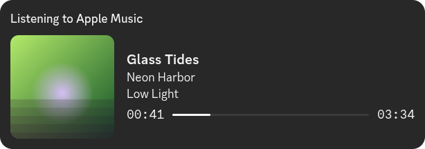

### Hi, I'm Rocky

Developer from Germany. I build tools for the Linux desktop, mostly around
KDE Plasma, and run [key64](https://www.key64.com), my own small platform
with a Discord bot, dashboard, status page and CDN.

Lately I'm working my way down the stack: kernel modules, DRM and V4L2.

###  Refrain

**Discord Rich Presence for Apple Music on Linux.** Apple Music has no Linux
app, and the web player never shows up in Discord. Refrain is a small tray app
that puts the song you're playing into your Discord status, with cover art.

- Reads music.apple.com in Chrome, Chromium, Firefox and Zen, or a phone over Bluetooth
- Optional Last.fm scrobbling, tray controls, recently played list, 10 languages
- No account, no telemetry, everything stored locally
- Install from the AUR (`yay -S refrain`) or PyPI

**[refrain.rockykln.com](https://refrain.rockykln.com)**

#### More projects

- **[podctl](https://podctl.rockykln.com)** – Control AirPods from the Linux command line: battery, listening mode, conversation awareness. *Rust*
- **[clientctl](https://clientctl.rockykln.com)** – Web control panel for a Linux desktop, secured with passkeys. *Python*

#### Setup

- **System:** CachyOS with KDE Plasma 6 on Wayland
- **Terminal:** fish in Konsole
- **Editors:** VS Code and Kate
- **Browsers:** Zen day to day; Firefox, Chrome and Chromium for testing Refrain
- **Test distros:** Ubuntu, Debian, Fedora and openSUSE in Podman containers via distrobox

#### Contact

[rockykln.com](https://www.rockykln.com) · [contact@rockykln.com](mailto:contact@rockykln.com)
